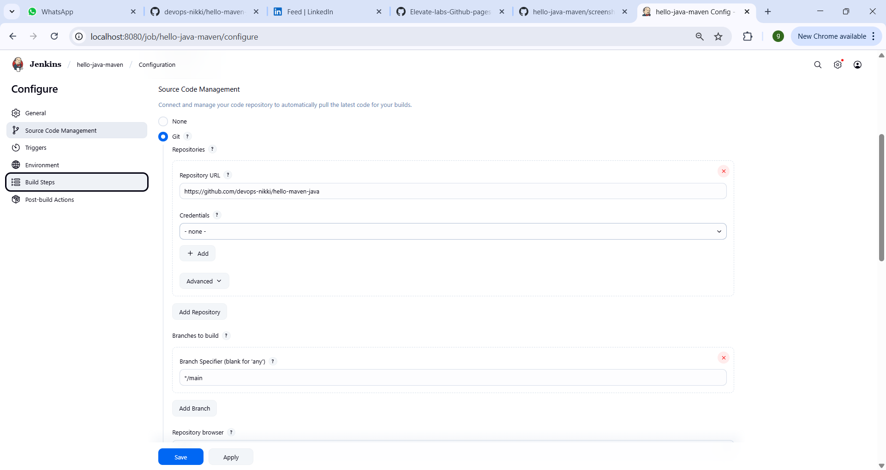
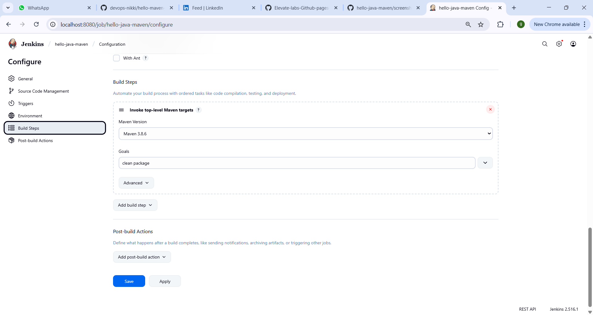

# Task 8 – Java Maven Build in Jenkins

## 📌 Project Overview
This project demonstrates how to automate a **Java Maven application build** using **Jenkins**.  
The pipeline fetches the source code from GitHub, builds it with Maven, and verifies the build status.  
It serves as a simple introduction to Continuous Integration (CI) workflows in real DevOps environments.

---

## 🛠 Tools & Technologies Used
- **Java JDK 11** (already available in Jenkins LTS Docker image)
- **Maven 3.8+**
- **Jenkins LTS** (Dockerized)
- **Git & GitHub**

---

## 📂 Project Structure

## 📂 Project Structure

```bash
hello-java-maven/
├── README.md
├── pom.xml
├── screenshots/
│   ├── job-config.png
│   └── build-success.png
└── src/
    └── main/
        └── java/
            └── HelloWorld.java
```

---

**HelloWorld.java**
```java
public class HelloWorld {
    public static void main(String[] args) {
        System.out.println("Hello, Jenkins + Maven!");
    }
}
```
---

## 🚀 Setup Instructions

**1. Create Java Maven Project Locally**

```bash
mkdir hello-java-maven && cd hello-java-maven
# Add pom.xml and HelloWorld.java as shown above
mvn clean package
```

---

**2. Push Project to GitHub**

```bash
git init
git add .
git commit -m "Initial Java Maven HelloWorld project"
git branch -M main
git remote add origin <your-repo-url>
git push -u origin main
```

---

**3. Run Jenkins in Docker**

```bash
docker run -p 8080:8080 jenkins/jenkins:lts
```

---

**4. Configure Jenkins**

  1. Install Maven

    - Manage Jenkins → Global Tool Configuration → Maven → Install automatically

  2. Create Freestyle Project

    - SCM: Git → Add repo URL

    - Build Step: Invoke Maven → Goals: clean package

---

**5. Build & Verify**

  - Click **Build Now**

  - Open **Console Output**

  - Look for:

    ```bash
    [INFO] BUILD SUCCESS
    ```

---

## 📸 Screenshots

- Jenkins Job Configuration	



- Build Success	


---

## 🎯 Learning Outcomes

 - Connect Jenkins to a GitHub repository

 - Use Maven in Jenkins to build Java applications

 - Understand basic CI workflow steps

 - Prepare groundwork for automated testing and deployment pipelines

---

## 📬 Contact
**Nikki Goyal** – DevOps Intern  
📧 Email: nikkigoyal679@gmail.com  
🔗 LinkedIn: [Nikki Goyal](https://www.linkedin.com/in/nikki-goyal-devops)

---

*Feel free to ⭐ this repository if you find it helpful!*